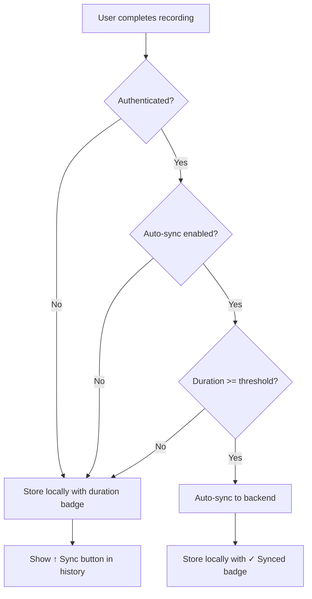
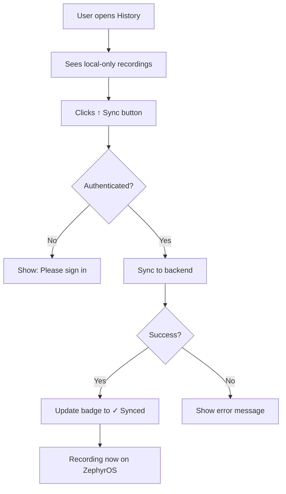

# Feature: Configurable Auto-Sync Threshold

**Date:** 2025-10-14
**Component:** MindFlow Browser Extension
**Feature Type:** Enhancement
**Status:** Implemented

---

## Overview

This feature adds intelligent, configurable auto-syncing to the ZephyrOS backend based on recording duration. Short recordings (below a configurable threshold) are kept local-only by default, while longer, more valuable recordings are automatically synced. Users can manually sync any local-only recording from the history view.

## Problem Statement

Not all voice recordings are equally valuable:
- **Short recordings** (<15-30 seconds) are often just quick thoughts, tests, or incomplete ideas
- **Longer recordings** (>30 seconds) typically contain more substantial content worth preserving in the cloud
- Syncing every recording creates unnecessary backend traffic and storage

**User Need:** Ability to control which recordings automatically sync to ZephyrOS backend based on their duration, while maintaining the option to manually sync any recording later.

---

## Solution

### 1. Configurable Auto-Sync Threshold

Added a new setting that allows users to:
- Enable/disable automatic backend syncing
- Set minimum recording duration (in seconds) for auto-sync
- Default threshold: **30 seconds**

### 2. Smart Sync Behavior

**Auto-Sync Logic:**
```javascript
if (authenticated && autoSyncEnabled && duration >= threshold) {
  sync_to_backend();
} else {
  store_locally_only();
}
```

**Recordings are auto-synced when:**
- ✅ User is authenticated with ZephyrOS
- ✅ Auto-sync is enabled in settings
- ✅ Recording duration ≥ threshold (default 30s)

**Recordings stay local-only when:**
- Recording duration < threshold
- User is not authenticated
- Auto-sync is disabled

### 3. Visual Sync Status

In the history view, each recording shows its sync status:

| Status | Badge | Action Available |
|--------|-------|------------------|
| **Synced** | `✓ Synced` (green) | View on Zflow platform |
| **Not Synced (Authenticated)** | `↑ Sync` button (blue) | Click to manually sync |
| **Not Synced (Not Authenticated)** | `Local only` (gray) | Sign in to sync |

### 4. Manual Sync

Users can manually sync any local-only recording:
1. Open History view
2. Find the recording with "↑ Sync" button
3. Click to sync to ZephyrOS backend
4. Status updates to "✓ Synced"

---

## Implementation Details

### Files Modified

#### 1. Constants & Settings ([src/common/constants.js](../../MindFlow-Extension/src/common/constants.js))

**New default settings:**
```javascript
export const DEFAULT_SETTINGS = {
  // ... existing settings

  // Sync Configuration
  autoSyncToBackend: true,      // Enable automatic syncing
  autoSyncThreshold: 30,         // Minimum duration in seconds
};
```

#### 2. Settings UI ([src/settings/settings.html](../../MindFlow-Extension/src/settings/settings.html))

**New section:**
```html
<section class="section">
  <h2 class="section-title">Backend Sync</h2>

  <div class="form-group">
    <label class="checkbox-label">
      <input type="checkbox" id="auto-sync-backend" checked />
      <span>Automatically sync to ZephyrOS backend</span>
    </label>
  </div>

  <div class="form-group">
    <label class="label" for="auto-sync-threshold">
      Minimum duration for auto-sync (seconds)
    </label>
    <input
      type="number"
      id="auto-sync-threshold"
      min="0"
      max="300"
      value="30"
    />
  </div>
</section>
```

#### 3. Recording Logic ([src/popup/popup.js](../../MindFlow-Extension/src/popup/popup.js))

**Updated `syncToBackend()` method:**
```javascript
async syncToBackend(force = false) {
  if (!zmemoryAPI.isAuthenticated()) {
    return false;
  }

  if (!force && settings.autoSyncToBackend) {
    const duration = this.currentResult.audioDuration || 0;
    const threshold = settings.autoSyncThreshold || 30;

    if (duration < threshold) {
      log(`⏭️ Skipping auto-sync: ${duration}s < ${threshold}s threshold`);
      return false; // Keep local-only
    }
  }

  // Proceed with sync...
  const result = await zmemoryAPI.createInteraction(interaction);

  // Mark as synced
  this.currentResult.syncedToBackend = true;
  this.currentResult.backendId = result.id;

  return true;
}
```

**History entry now includes:**
```javascript
await storageManager.saveHistoryEntry({
  original: this.currentResult.original,
  optimized: this.currentResult.optimized,
  teacherNotes: this.currentResult.teacherNotes,
  level: this.currentResult.level,
  audioDuration: this.currentResult.audioDuration,     // NEW
  syncedToBackend: this.currentResult.syncedToBackend, // NEW
  backendId: this.currentResult.backendId              // NEW
});
```

#### 4. History View ([src/history/history.js](../../MindFlow-Extension/src/history/history.js))

**Visual sync status:**
```javascript
const syncStatus = entry.syncedToBackend
  ? '<span class="sync-badge synced">✓ Synced</span>'
  : (isAuthenticated
      ? '<button class="sync-btn">↑ Sync</button>'
      : '<span class="sync-badge not-synced">Local only</span>');
```

**Manual sync handler:**
```javascript
async handleSync(entry) {
  const interaction = {
    transcriptionApi: 'OpenAI',
    transcriptionModel: 'whisper-1',
    optimizationModel: settings.llmModel || 'gpt-4o-mini',
    optimizationLevel: entry.level || settings.optimizationLevel,
    outputStyle: outputStyle,
    originalText: entry.original,
    optimizedText: entry.optimized,
    teacherNotes: entry.teacherNotes || null,
    audioDurationSeconds: entry.audioDuration || null
  };

  const result = await zmemoryAPI.createInteraction(interaction);

  // Update entry
  await storageManager.updateHistoryEntry(entry.id, {
    syncedToBackend: true,
    backendId: result.id
  });

  this.showToast('✓ Synced to ZephyrOS');
}
```

#### 5. Storage Manager ([src/lib/storage-manager.js](../../MindFlow-Extension/src/lib/storage-manager.js))

**New method:**
```javascript
async updateHistoryEntry(id, updates) {
  const history = await this.getHistory();
  const index = history.findIndex(entry => entry.id === id);

  if (index === -1) {
    throw new Error(`History entry not found: ${id}`);
  }

  // Merge updates
  history[index] = {
    ...history[index],
    ...updates
  };

  await this.storage.local.set({
    [STORAGE_KEYS.HISTORY]: history
  });
}
```

#### 6. Styles ([src/history/history.css](../../MindFlow-Extension/src/history/history.css))

**New CSS:**
```css
/* Sync Badge - Synced */
.sync-badge.synced {
  background-color: #E8F5E9;
  color: #2E7D32;
}

/* Sync Badge - Not Synced */
.sync-badge.not-synced {
  background-color: var(--bg-tertiary);
  color: var(--text-tertiary);
}

/* Sync Button */
.sync-btn {
  background-color: var(--color-primary);
  color: white;
  padding: 3px 10px;
  font-size: 11px;
  border-radius: 4px;
  cursor: pointer;
}

.sync-btn:hover {
  background-color: var(--color-primary-hover);
  transform: translateY(-1px);
}

/* Duration Badge */
.duration-badge {
  background-color: var(--bg-tertiary);
  color: var(--text-secondary);
  padding: 2px 6px;
  font-size: 10px;
}
```

---

## User Flow

### New Recording Flow



### Manual Sync Flow



---

## Configuration Options

### Settings Panel

**Location:** Settings → Backend Sync

**Options:**

1. **Automatically sync to ZephyrOS backend**
   - Type: Checkbox
   - Default: `true` (enabled)
   - Description: "Short recordings can be kept local-only and synced manually later"

2. **Minimum duration for auto-sync**
   - Type: Number input (0-300 seconds)
   - Default: `30` seconds
   - Description: "Recordings shorter than this will only be stored locally unless manually synced"

### Example Configurations

**Conservative (sync most recordings):**
```javascript
{
  autoSyncToBackend: true,
  autoSyncThreshold: 10  // 10 seconds
}
```

**Balanced (default):**
```javascript
{
  autoSyncToBackend: true,
  autoSyncThreshold: 30  // 30 seconds
}
```

**Selective (sync only long recordings):**
```javascript
{
  autoSyncToBackend: true,
  autoSyncThreshold: 60  // 1 minute
}
```

**Local-only mode:**
```javascript
{
  autoSyncToBackend: false,
  autoSyncThreshold: 30  // Irrelevant when auto-sync disabled
}
```

---

## Benefits

### 1. **Reduced Backend Load**
- Fewer unnecessary API calls
- Less storage consumption
- Lower bandwidth usage

### 2. **Improved User Experience**
- No clutter from test recordings or quick thoughts
- Clear visual indication of sync status
- Flexibility to sync later if needed

### 3. **Better Data Quality**
- Backend contains more valuable, substantial content
- Easier to analyze thought patterns
- Better signal-to-noise ratio

### 4. **Privacy Control**
- Users decide which content goes to the cloud
- Short, personal notes stay local by default
- Manual sync gives explicit control

---

## Testing

### Test Cases

#### 1. Auto-Sync Threshold (Authenticated)

| Recording Duration | Threshold | Expected Behavior |
|-------------------|-----------|-------------------|
| 15s | 30s | Local only, show "↑ Sync" |
| 30s | 30s | Auto-sync, show "✓ Synced" |
| 45s | 30s | Auto-sync, show "✓ Synced" |
| 25s | 10s | Auto-sync, show "✓ Synced" |
| 5s | 10s | Local only, show "↑ Sync" |

#### 2. Not Authenticated

| Scenario | Expected Behavior |
|----------|-------------------|
| Any recording | Local only, show "Local only" badge |
| Click sync button | N/A (button not shown) |

#### 3. Manual Sync

| Initial State | Action | Expected Result |
|---------------|--------|-----------------|
| Local only, authenticated | Click "↑ Sync" | Syncs to backend, badge → "✓ Synced" |
| Local only, not authenticated | N/A | "Local only" badge shown, no button |
| Already synced | N/A | "✓ Synced" badge shown, no button |

#### 4. Settings Changes

| Action | Expected Behavior |
|--------|-------------------|
| Disable auto-sync | All recordings stay local with "↑ Sync" button |
| Lower threshold (60s → 15s) | More recordings auto-sync |
| Raise threshold (15s → 60s) | Fewer recordings auto-sync |

---

## Future Enhancements

### 1. **Bulk Sync**
- Select multiple local-only recordings
- Sync all at once
- Progress indicator

### 2. **Smart Sync Heuristics**
- Consider content length (word count)
- Consider teacher notes presence
- Consider optimization level

### 3. **Sync Statistics**
- Show total synced vs local
- Show bandwidth saved
- Show storage used

### 4. **Selective Delete**
- Delete local copy after successful sync
- Keep backend copy only
- Free up local storage

### 5. **Sync Queue**
- Offline recording support
- Queue for later sync
- Retry failed syncs automatically

---

## Related Documentation

- [Debugging: Supabase Auth & API Integration](../debugging/supabase-auth-api-integration.md)
- [Architecture: Storage Manager](../architecture/storage-manager.md)
- [API: ZMemory Integration](../api/zmemory-integration.md)

---

## Summary

This feature provides intelligent, configurable syncing that:
- ✅ Reduces unnecessary backend traffic
- ✅ Keeps short/test recordings local by default
- ✅ Auto-syncs valuable content (>30s by default)
- ✅ Allows manual sync of any recording
- ✅ Provides clear visual sync status
- ✅ Gives users full control over their data

**Default threshold of 30 seconds** strikes a balance between:
- Filtering out quick tests and incomplete thoughts
- Capturing most meaningful conversations and ideas
- Minimizing backend storage costs
- Maximizing user flexibility

The feature seamlessly integrates with existing authentication and storage systems, requiring no backend changes and maintaining backward compatibility with existing recordings.
